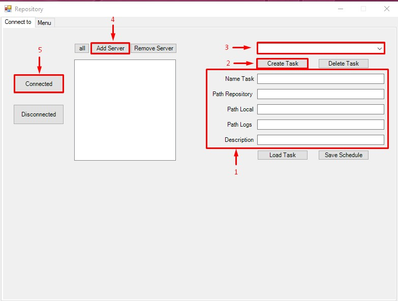
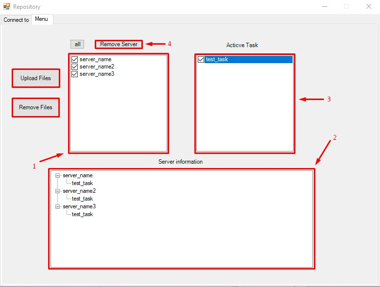

# Prog > Repository-for-Windows

Программа автоматизирует копирование данных на большое количество серверов.\
Скачивание выполняется самим сервером.

Версия PowerShell 5.1.17134.858

## Описание
------------
В сети необходимо разместить сетевой каталог(Репозиторий), создать каталоги с данными. \
Разделение каталогов может быть по признаку.\
Информация хранящаяся в данных каталогах будет копироваться удаленным клиентом.\
Работать нужно от учетной записи являющейся администратором на клиенте.

Запускаем от другого пользователя, зажимаем Shift + правой кнопкой на ярлыке, выбираем запустить от другого пользователя. Вводим данные.

## Внешний вид и работа с приложением
------------
В приложение есть 2 вкладки `"Connect to"` и `"Menu"`

### -> Вкладка "Connect to"
Данная вкладка отвечает за подключение и добавление сервера в репозиторий, а так же за создание задание-клиента на удаленном сервере \ комьютере.


1. Первое что необходимо сделать это создать задание которое будет распространено на удаленные машины. Для этого необходимо заполнить поля 
   - Name Task - Название задания
   - Path Repository - Путь до репозетория в сети
   - Path Local - Путь до расположения файло на клиенте, локальный диск
   - Path Logs - Путь куда будут сохранятся логи при выполнение копирования
   - Description - Более детальное описание задачи

2. Создаем задание `"Create Task"`
3. В списке доступных задание должно отобразиться наше `"Name Task"`\
   Если в списке больше одного задания то при выборе задания обязательно надо будет загружать задание что бы данные подтягивались для этого выбираем задание и нажимаем `"Load Task"` наша форма заполняется сохраненными данными, так же можно изменить данные и сохранить их.
4. Добавляем клиента в список на подключение к репозиторию. Я повившемся окне водим имя клиента. 
5. После добавления клиентов в список, выбираем необходимое задание в меню (3) и нажимаем `"Connected"`. Все клиенты перемещаются на вкладку `"Menu"`, что означает что задания на клиента успешно созданы.

### -> Вкладка "Menu"
Данная вкладка отвечает за работу репозитрия и позволяет загружать и удалять необходимые каталоги на клиентах, так же отображает список заданий распрастраненный на клиенте.


1. Окно с клиентами, для выбора определенных либо всех клиентов.
2. Окно `"Server information"` содержит информацию по всем клиентам и дает возможность посмотреть какие задания распространены на клиенте.
3. Окно `"Active task"` содержит все доступные задания для загрузки на клиента.
4. Для удаления клиента из репозитория необходимо так же выделить в списке необходимые значения и нажать `"Remove Server"`, клиент будет перемещен на вкладку в для удаления заданий.
   
### Процедура удаления клиента из репозитория
1. На вкладке `"Menu"` выделям необходимые клиенты - удаляем все файлы по заданиям из списка с клиента через `"Remove files"`.
2. Жмем `"Remove Server"`, клиент попадает на вкладку `"Connect to"`, где мы должны удалить с него назначенные на него задания.
3. Для этого из списка заданий выбираем те которые распространены на наш клиент (посмотреть можно на вкладке `"Menu"` -> `"Server information"`), жмем `"Load Task"`, что бы подтянуть все данные задания.
4. После чего жмем `"Diconnected"`. Задание удаляется с сервера. Если несколько заданий повторяем все с п.3 для другого задания.
5. Удаляем сервер из репозитория жмем `"Remove Server"`.

Программу можно скомпилировать для этого:
```Powershell
# Устанавливаем модуль для компиляции
Install-Module -name ps2exe

# Компилируем программу
Invoke-PS2EXE C:\repository.ps1 C:\repository.exe
ps2exe -inputFile C:\repository.ps1  -outputFile С:\repository.exe

```

### На этом все, Благодарю за внимание и интерес!
